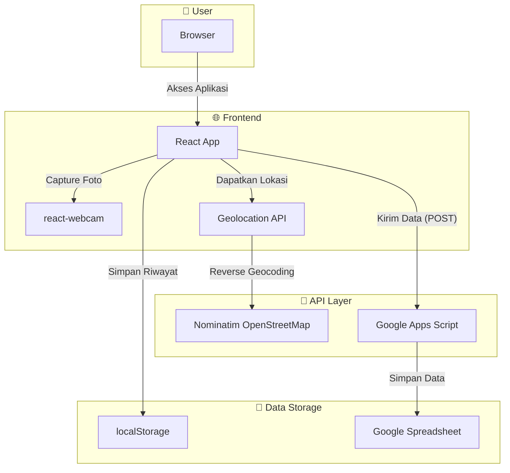
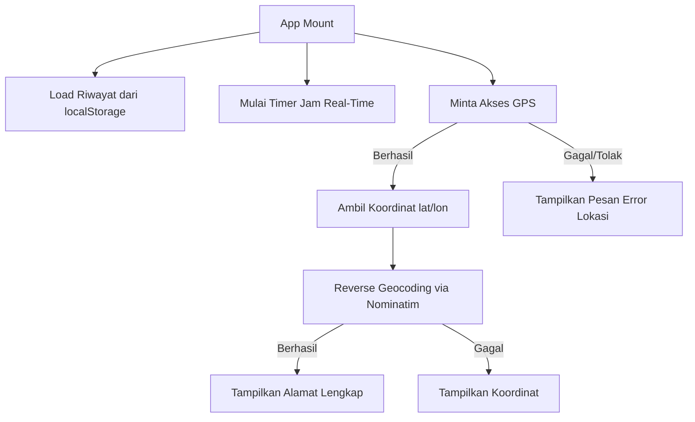
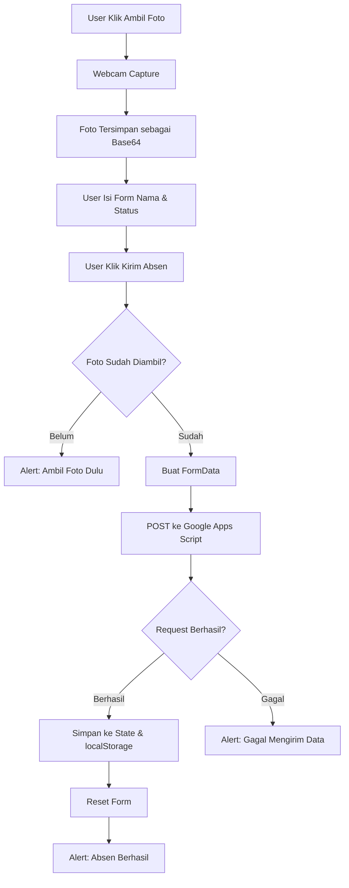
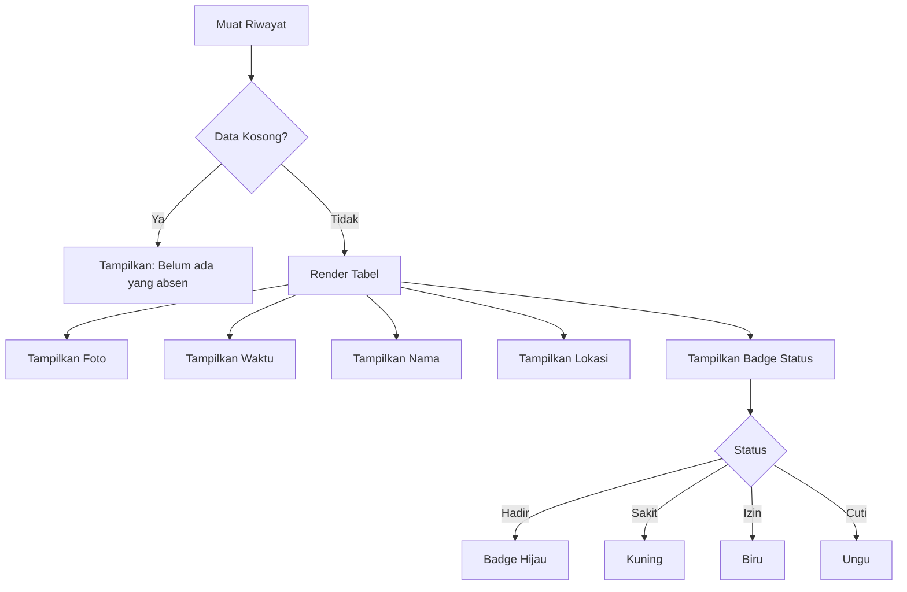
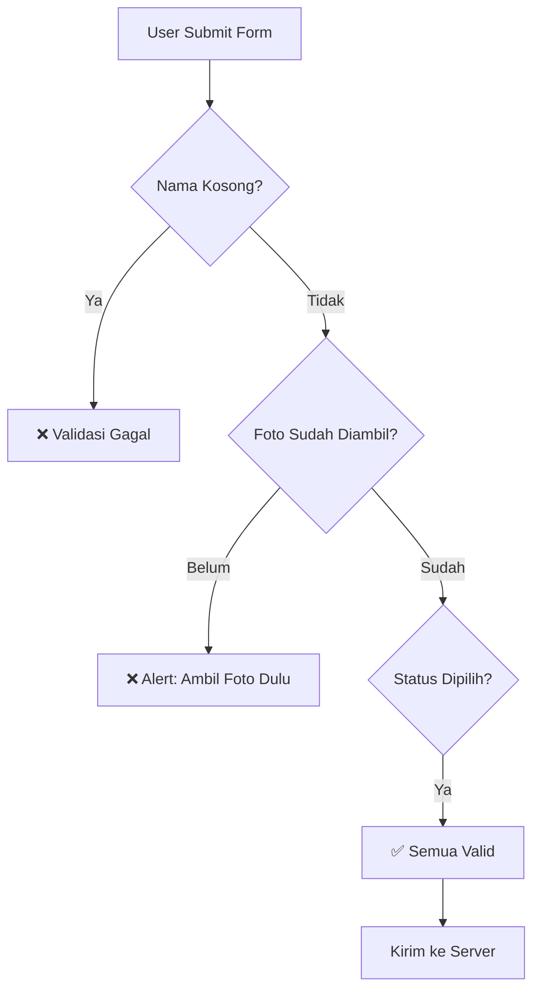

<div align="center">

# 🏢 JNN Laundry Attendance System

**Sistem absensi digital berbasis web dengan verifikasi selfie & lokasi GPS**

[](https://react.dev)
[](https://vitejs.dev)
[](https://developer.mozilla.org/en-US/docs/Web/JavaScript)
[](https://developer.mozilla.org/en-US/docs/Web/HTML)
[](https://developer.mozilla.org/en-US/docs/Web/CSS)
[](#deployment)
[](#license)

<br/>

[](#live-demo)
[](../../issues)
[](../../issues)

---

Aplikasi absensi web yang memungkinkan karyawan **JNN Laundry** melakukan presensi harian dengan selfie sebagai bukti kehadiran dan GPS sebagai verifikasi lokasi. Data dikirim langsung ke Google Spreadsheet melalui Google Apps Script.

<br/>


</div>

---

## 📑 Daftar Isi

- [Live Demo](#-live-demo)
- [Fitur](#-fitur)
- [Tech Stack](#-tech-stack)
- [Project Structure](#-project-structure)
- [Arsitektur Sistem](#-arsitektur-sistem)
- [Alur Program](#-alur-program)
- [Instalasi](#-instalasi)
- [Penggunaan](#-penggunaan)
- [Deployment](#deployment)
- [API Flow](#-api-flow)
- [Validation Flow](#-validation-flow)
- [Error Handling](#-error-handling)
- [Keamanan & Privasi](#-keamanan--privasi)
- [Browser Compatibility](#-browser-compatibility)
- [Performa](#-performa)
- [Screenshots](#-screenshots)
- [Tantangan & Solusi](#-tantangan--solusi)
- [Roadmap](#-roadmap)
- [Known Issues](#-known-issues)
- [FAQ](#-faq)
- [Contributing](#-contributing)
- [License](#-license)
- [Author](#-author)
- [Acknowledgements](#-acknowledgements)

---

## 🚀 Live Demo

> **URL:** [https://absenkaryawanjnn.vercel.app](https://absenkaryawanjnn.vercel.app)

> ⚠️ **Catatan:** Aplikasi membutuhkan akses **kamera** dan **lokasi**. Pastikan browser mengizinkan permissions saat diminta.

---

## ✨ Fitur

| Fitur | Deskripsi |
|-------|-----------|
| 📸 **Selfie Absensi** | Ambil foto selfie langsung dari webcam sebagai bukti kehadiran |
| 📍 **Lokasi GPS** | Otomatis mendeteksi lokasi dan menerjemahkan koordinat menjadi alamat |
| 🕐 **Jam Real-Time** | Tampilan waktu dan tanggal secara real-time |
| ✅ **Status Kehadiran** | Pilihan status: Hadir, Sakit, Izin, Cuti |
| 📋 **Riwayat Absensi** | Tabel riwayat harian yang tersimpan di localStorage |
| ☁️ **Sinkronisasi Cloud** | Data otomatis terkirim ke Google Spreadsheet |
| 📱 **Responsive Design** | Tampilan optimal di desktop maupun mobile |
| ⚡ **Performa Cepat** | Dibangun dengan Vite untuk loading super cepat |

---

## 🛠 Tech Stack

| Layer | Teknologi |
|-------|-----------|
| **Framework** | [React 19](https://react.dev) |
| **Build Tool** | [Vite 8](https://vitejs.dev) |
| **Kamera** | [react-webcam](https://github.com/mozmorris/react-webcam) |
| **Lokasi** | [Geolocation API](https://developer.mozilla.org/en-US/docs/Web/API/Geolocation_API) + [Nominatim](https://nominatim.openstreetmap.org/) (Reverse Geocoding) |
| **Backend** | [Google Apps Script](https://script.google.com) |
| **Database** | Google Spreadsheet |
| **Penyimpanan Lokal** | localStorage |
| **Deployment** | [Vercel](https://vercel.com) |
| **Linting** | [OxLint](https://oxc.rs) |

---

## 📂 Project Structure

```
absenkaryawanjnn/
├── public/
│   ├── favicon.svg
│   └── icons.svg
├── src/
│   ├── assets/
│   │   └── (gambar & aset statis)
│   ├── App.css          # Style utama aplikasi
│   ├── App.jsx          # Komponen utama (logic & UI)
│   ├── index.css         # Global styles
│   └── main.jsx          # Entry point React
├── .gitignore
├── .oxlintrc.json        # Konfigurasi OxLint
├── index.html            # HTML template
├── package.json
├── package-lock.json
├── vite.config.js        # Konfigurasi Vite
└── README.md
```

> 📌 **Note:** Proyek ini sengaja menggunakan **single-component architecture** karena scope aplikasi yang terfokus pada satu halaman absensi.

---

## 🏗 Arsitektur Sistem



---

## 🔄 Alur Program

### Alur Inisialisasi



### Alur Absensi



### Alur Riwayat



---

## 📦 Instalasi

### Prasyarat

- [Node.js](https://nodejs.org) v18 atau lebih tinggi
- [npm](https://www.npmjs.com) atau [yarn](https://yarnpkg.com) atau [pnpm](https://pnpm.io)
- Browser dengan dukungan **WebRTC** (untuk webcam) dan **Geolocation API**

### Langkah Instalasi

```bash
# 1. Clone repository
git clone https://github.com/username/absenkaryawanjnn.git

# 2. Masuk ke direktori project
cd absenkaryawanjnn

# 3. Install dependencies
npm install

# 4. Jalankan development server
npm run dev
```

Aplikasi akan berjalan di `http://localhost:5173`

---

## 📖 Penggunaan

### Development

```bash
npm run dev        # Jalankan dev server dengan HMR
npm run lint       # Jalankan linting dengan OxLint
npm run build      # Build untuk produksi
npm run preview    # Preview hasil build
```

### Penggunaan Aplikasi

1. **Buka aplikasi** di browser (localhost atau URL deployed)
2. **Izinkan akses** kamera dan lokasi saat diminta
3. **Ambil foto selfie** dengan klik tombol 📸
4. **Isi nama** karyawan
5. **Pilih status** kehadiran (Hadir / Sakit / Izin / Cuti)
6. **Klik "Kirim Absen"** untuk mengirim data
7. **Lihat riwayat** di tabel bagian bawah halaman

---

## 🌐 Deployment

Aplikasi ini menggunakan **Vercel** untuk deployment. Berikut panduan deploy:

### Deploy ke Vercel

```bash
# 1. Install Vercel CLI
npm i -g vercel

# 2. Login ke Vercel
vercel login

# 3. Deploy
vercel

# 4. Deploy ke produksi
vercel --prod
```

### Environment

| Variable | Description |
|----------|-------------|
| `SCRIPT_URL` | URL Google Apps Script yang sudah di-deploy |

> 📌 Google Apps Script URL sudah di-hardcode di dalam `App.jsx`. Untuk produksi, pertimbangkan untuk menggunakan environment variable.

---

## 🔌 API Flow

### Google Apps Script

Aplikasi mengirim data via `POST` ke Google Apps Script yang berfungsi sebagai API proxy:

```
React App  →  POST /exec  →  Google Apps Script  →  Google Spreadsheet
```

### Data yang Dikirim

| Field | Tipe | Contoh |
|-------|------|--------|
| `Tanggal` | String | `23/07/2026` |
| `Waktu` | String | `14:30` |
| `Nama` | String | `Budi Santoso` |
| `Lokasi` | String | `Jl. Merdeka No. 10, Jakarta` |
| `Status` | String | `Hadir` |
| `Foto` | String (Base64) | `data:image/jpeg;base64,...` |

### Request Detail

```javascript
// Method
POST

// Body
FormData

// Mode
no-cors

// Content-Type (otomatis)
multipart/form-data
```

---

## ✅ Validation Flow



### Validasi yang Diterapkan

| Field | Validasi | Tipe Error |
|-------|----------|------------|
| Nama | Required, tidak boleh kosong | HTML5 `required` |
| Foto | Harus diambil sebelum submit | Custom validation |
| Status | Required, pilihan dropdown | HTML5 `required` |
| Lokasi | Diambil otomatis, tidak wajib | Graceful fallback |

---

## ⚠️ Error Handling

| Error | Penyebab | Solusi |
|-------|----------|--------|
| **"No provider available"** | Webcam tidak terdeteksi | Pastikan kamera terhubung, cek izin browser |
| **"Gagal mengirim data"** | Request ke GAS gagal | Cek koneksi internet, validasi URL GAS |
| **"Akses lokasi ditolak"** | User menolak izin lokasi | Minta user mengizinkan lokasi di browser |
| **"Browser tidak mendukung"** | Browser lama tanpa Geolocation API | Gunakan browser modern (Chrome/Firefox/Edge) |
| **CORS Error** | Mode `no-cors` membatasi respons | Normal untuk POST ke GAS; gunakan `mode: 'no-cors'` |

### Penanganan Error di Aplikasi

```javascript
// GPS Error Handling
navigator.geolocation.getCurrentPosition(
  (position) => { /* handle success */ },
  () => setLokasi('Akses lokasi ditolak/gagal')  // Graceful fallback
);

// Fetch Error Handling
try {
  await fetch(SCRIPT_URL, { method: 'POST', body: formData, mode: 'no-cors' });
  // Handle success
} catch {
  alert("Gagal mengirim data!");  // User-friendly error message
}
```

---

## 🔒 Keamanan & Privasi

### Yang Dilakukan

- ✅ **Lokasi hanya digunakan sekali** per sesi absensi
- ✅ **Foto disimpan sebagai base64** di memori, tidak di-upload ke server eksternal
- ✅ **localStorage** hanya menyimpan data lokal (riwayat hari ini)
- ✅ **Tidak ada autentikasi** yang disimpan di client

### Yang Perlu Diperhatikan

- ⚠️ **Foto base64** disimpan di localStorage — ukuran terbatas (~5MB per origin)
- ⚠️ **Tidak ada enkripsi** data di localStorage
- ⚠️ **Google Apps Script URL** di-hardcode — gunakan environment variable untuk produksi
- ⚠️ **Tidak ada rate limiting** di sisi client

### Rekomendasi untuk Produksi

- Gunakan **enkripsi** sebelum menyimpan ke localStorage
- Implementasikan **autentikasi** (login system)
- Gunakan **backend server** (Node.js/Express) sebagai proxy
- Implementasikan **rate limiting** di server
- Gunakan **environment variable** untuk URL endpoint

---

## 🌍 Browser Compatibility

| Browser | Status |
|---------|--------|
| Chrome 90+ | ✅ Fully Supported |
| Firefox 88+ | ✅ Fully Supported |
| Edge 90+ | ✅ Fully Supported |
| Safari 14+ | ✅ Fully Supported |
| Opera 76+ | ✅ Fully Supported |
| Chrome Android | ✅ Fully Supported |
| Safari iOS | ⚠️ Partial (camera permission UX differs) |
| IE 11 | ❌ Not Supported |

### Fitur yang Dibutuhkan

- [MediaDevices API](https://developer.mozilla.org/en-US/docs/Web/API/MediaDevices) (Webcam)
- [Geolocation API](https://developer.mozilla.org/en-US/docs/Web/API/Geolocation_API) (GPS)
- [Fetch API](https://developer.mozilla.org/en-US/docs/Web/API/Fetch_API) (HTTP Request)
- [localStorage](https://developer.mozilla.org/en-US/docs/Web/API/Window/localStorage) (Penyimpanan Lokal)

---

## ⚡ Performa

### Optimasi yang Sudah Dilakukan

| Optimasi | Deskripsi |
|----------|-----------|
| **Vite Build** | Bundling optimal dengan tree-shaking |
| **Lazy State Init** | `riwayatAbsen` diinisialisasi dengan lazy initializer |
| **Callback Memoization** | `ambilFoto` menggunakan `useCallback` |
| **Interval Cleanup** | Timer jam di-cleanup dengan `clearInterval` |
| **Minimal Dependencies** | Hanya 3 dependencies utama (React, ReactDOM, react-webcam) |

### Metrik yang Perlu Dipantau

| Metrik | Target |
|--------|--------|
| **First Contentful Paint** | < 1.5s |
| **Largest Contentful Paint** | < 2.5s |
| **Time to Interactive** | < 3.5s |
| **Bundle Size** | < 200KB gzipped |

---

## 📸 Screenshots

<div align="center">

### Desktop View


<br/>

### Mobile View


<br/>

### Riwayat Absensi


</div>

---

## 🧩 Tantangan & Solusi

| Tantangan | Solusi |
|-----------|--------|
| **Webcam tidak bisa diakses tanpa HTTPS** | Menggunakan `localhost` untuk development (otomatis aman), Vercel HTTPS untuk produksi |
| **GPS koordinat sulit dipahami user** | Integrasi Nominatim OpenStreetMap untuk reverse geocoding → alamat manusia |
| **CORS restriction pada Google Apps Script** | Menggunakan `mode: 'no-cors'` pada fetch request |
| **localStorage dibatasi ~5MB** | Menyimpan data riwayat hanya untuk hari ini, base64 foto dikompresi via JPEG |
| **Error "No provider available"** | Menambahkan fallback message dan documentasi troubleshooting |
| **Responsive di berbagai device** | Menggunakan CSS flexbox dan relative units |

---

## 🗺 Roadmap

- [ ] 🔐 Sistem autentikasi (login/register)
- [ ] 📊 Dashboard admin untuk melihat semua absensi
- [ ] 📅 Filter riwayat berdasarkan tanggal
- [ ] 📥 Export data ke CSV/Excel
- [ ] 🔔 Notifikasi push untuk pengingat absen
- [ ] 🌙 Dark mode toggle
- [ ] 📸 Kompresi foto otomatis sebelum upload
- [ ] 🗄️ Backend server (Node.js/Express) sebagai proxy
- [ ] 📍 Geofencing (absensi hanya di area tertentu)
- [ ] 📱 Progressive Web App (PWA)
- [ ] 🧪 Unit testing & integration testing
- [ ] 🔄 Sinkronisasi offline → online

---

## 🐛 Known Issues

| Issue | Status | Catatan |
|-------|--------|---------|
| Riwayat hilang saat clear browser data | 🟡 Known | Data tersimpan di localStorage |
| Foto base64 memakan memori | 🟡 Known | Batas ~5MB per origin |
| GPS timeout di dalam ruangan | 🟡 Known | Bergantung pada signal GPS |
| Safari iOS camera UX berbeda | 🟡 Known | Permission dialog berbeda |
| Tidak ada multi-device sync | 🔵 Planned | Akan ditambahkan di roadmap |

---

## ❓ FAQ

<details>
<summary><strong>Kenapa muncul error "No provider available"?</strong></summary>

Error ini muncul karena webcam tidak terdeteksi. Penyebab:
1. Tidak ada kamera di device
2. Izin kamera ditolak di browser
3. Kamera sedang dipakai aplikasi lain

**Solusi:** Gunakan `npm run dev` (localhost otomatis diizinkan akses kamera).

</details>

<details>
<summary><strong>Apakah data tersimpan di server?</strong></summary>

Ya. Data absensi dikirim ke Google Spreadsheet melalui Google Apps Script. Riwayat lokal di localStorage hanya sebagai cadangan untuk tampilan di halaman.

</details>

<details>
<summary><strong>Bagaimana cara deploy ke Vercel?</strong></summary>

```bash
npm i -g vercel
vercel login
vercel --prod
```

Pastikan Google Apps Script sudah di-deploy dan URL-nya benar.

</details>

<details>
<summary><strong>Bisakah dipakai tanpa kamera?</strong></summary>

Tidak. Foto selfie adalah fitur utama sebagai bukti kehadiran. Tanpa kamera, proses absensi tidak bisa dilanjutkan.

</details>

<details>
<summary><strong>Mengapa menggunakan Google Apps Script?</strong></summary>

Google Apps Script menjadi solusi backend gratis tanpa perlu server sendiri. Cocok untuk skala kecil seperti absensi karyawan laundry.

</details>

---

## 🤝 Contributing

Kontribusi sangat dipersilakan! Berikut cara berkontribusi:

1. **Fork** repository ini
2. **Create** branch baru (`git checkout -b feature/fitur-baru`)
3. **Commit** perubahan (`git commit -m 'feat: tambah fitur baru'`)
4. **Push** ke branch (`git push origin feature/fitur-baru`)
5. **Buka** Pull Request

### Commit Convention

Gunakan [Conventional Commits](https://www.conventionalcommits.org/):

```
feat:     fitur baru
fix:      perbaikan bug
docs:     perubahan dokumentasi
style:    format kode
refactor: refactor kode
test:     penambahan test
chore:    maintenance
```

---

## 📄 License

Distributed under the **MIT License**.

```
MIT License

Copyright (c) 2026 Imanuel

Permission is hereby granted, free of charge, to any person obtaining a copy
of this software and associated documentation files (the "Software"), to deal
in the Software without restriction, including without limitation the rights
to use, copy, modify, merge, publish, distribute, sublicense, and/or sell
copies of the Software, and to permit persons to whom the Software is
furnished to do so, subject to the following conditions:

The above copyright notice and this permission notice shall be included in all
copies or substantial portions of the Software.

THE SOFTWARE IS PROVIDED "AS IS", WITHOUT WARRANTY OF ANY KIND, EXPRESS OR
IMPLIED, INCLUDING BUT NOT LIMITED TO THE WARRANTIES OF MERCHANTABILITY,
FITNESS FOR A PARTICULAR PURPOSE AND NONINFRINGEMENT. IN NO EVENT SHALL THE
AUTHORS OR COPYRIGHT HOLDERS BE LIABLE FOR ANY CLAIM, DAMAGES OR OTHER
LIABILITY, WHETHER IN AN ACTION OF CONTRACT, TORT OR OTHERWISE, ARISING FROM,
OUT OF OR IN CONNECTION WITH THE SOFTWARE OR THE USE OR OTHER DEALINGS IN THE
SOFTWARE.
```

---

## 👨‍💻 Author

**Imanuel**

[](https://github.com/username)
[](mailto:email@example.com)

---

## 🙏 Acknowledgements

Terima kasih kepada:

- [React](https://react.dev) — UI Library
- [Vite](https://vitejs.dev) — Build Tool
- [react-webcam](https://github.com/mozmorris/react-webcam) — Webcam Component
- [OpenStreetMap Nominatim](https://nominatim.openstreetmap.org) — Reverse Geocoding API
- [Google Apps Script](https://script.google.com) — Backend Service
- [Vercel](https://vercel.com) — Deployment Platform
- [OxLint](https://oxc.rs) — Linter

---

<div align="center">

**Dibuat dengan ❤️ untuk JNN Laundry**

[⬆ Kembali ke Atas](#-jnn-laundry-attendance-system)

</div>
